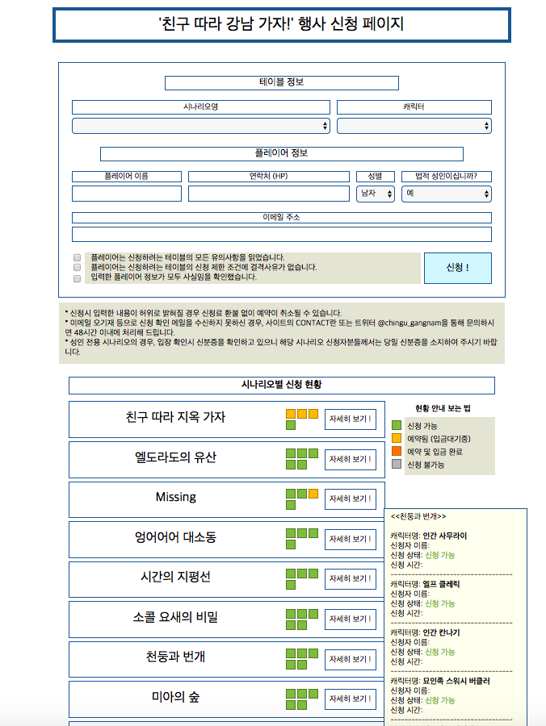

TRPG Registration & Management
---
_Convenient TRPG Registration & Management_



1. 기능 설명
    1. 신청폼 제공
        1. 특정 시나리오를 선택하면 해당 시나리오의 '지원가능한' 상태의 캐릭터만 선택지로 뜬다.
        2. 현재 시나리오들의 등록 상태를 시각적으로 확인할 수 있다.
    2. 관리자 페이지 (http://www.xxx.xx/admin)
        1. 시나리오와 캐릭터를 관리자 페이지에서 등록 가능
        2. 등록된 시나리오, 캐릭터, 참가자 정보를 열람 및 수정 가능
    3. 자동 이메일 발송
        1. 참가자가 신청한 경우, 참가자에게 등록 완료 이메일을 발송한다.
        2. 이메일 발송은 mysite/mysite/settings.py 의 EMAIL_HOST, EMAIL_HOST_USER, EMAIL_HOST_PASSWORD로 설정한 SMTP서버를 통해 이루어진다.


2. Super Quick Start
    1. AWS Elastic Beanstalk에 EB CLI로 사이트를 올린다.
    

3. Quick Start (비교적 상세한 설명)
    1. Amazon Web Service에 가입한다.
    2. https://docs.aws.amazon.com/ko_kr/elasticbeanstalk/latest/dg/eb-cli3-install.html를 참고해서 EB CLI를 설치한다
    3. console(cmd)에서 mysite폴더로 들어간다음 eb init을 입력하고 물어보는거 답해준다.
    4. eb create를 입력하고 물어보는거 답해주고 기다린다.
    5. eb open을 입력하면 브라우저가 자동으로 열리면서 사이트가 뜬다.
    

---
4. 개발 환경
    1. 사용 언어: Python3.4 Django1.10
    2. 서버 호스팅: AWS (Amazon Web Service) Elastic Beanstalk 기준
        1. .ebextensions에 관련 설정 (crontab 등)이 들어 있음.
    3. 타 서버 호스팅 관련 주의 사항
        1. crontab (django-crontab)을 이용하고 있음 (Email 15분 마다 발송)
            1. crontab 등록
            ```commandline
            in ../mysite
            >> python manage.py crontab add
            ```
            2. crontab 삭제
            ```commandline
            in ../mysite
            >> python manage.py crontab remove
            ```
            3. 등록된 crontab 확인
            ```commandline
            in ../mysite
            >> python manage.py crontab show
            ```
            >*expected result*
            >```commandline
            >Currently active jobs in crontab:
            >#your_crontab_id -> ('*/15 * * * *', 'mysite.apps.mail.cron.email_sending')
            >```
        2. DB를 로컬 파일로 저장하고 있음 (db.sqlite3)
    4. 로컬 환경 테스트 관련 주의 사항
        1. static 파일
            1. DJANGO_SETTING의 STATIC_ROOT가 static으로 지정된 관계로 static폴더에 직접 파일을 추가할 경우, collectstatic을 해도
            로컬에서 static 파일을 읽지 못함.
            2. 따라서 static_local 폴더를 생성해 추가적인 static 파일을 넣을 것.